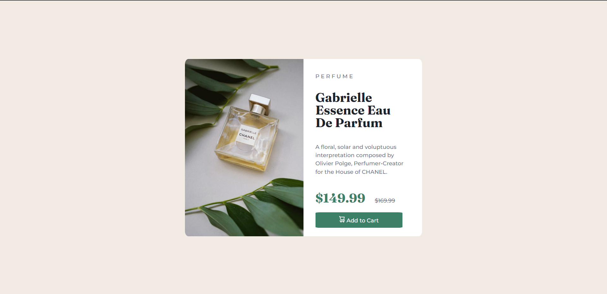

# Frontend Mentor - Product preview card component solution

This is a solution to the [Product preview card component challenge on Frontend Mentor](https://www.frontendmentor.io/challenges/product-preview-card-component-GO7UmttRfa). Frontend Mentor challenges help you improve your coding skills by building realistic projects. 

## Table of contents

- [Overview](#overview)
  - [The challenge](#the-challenge)
  - [Screenshot](#screenshot)
  - [Links](#links)
- [My process](#my-process)
  - [Built with](#built-with)
  - [What I learned](#what-i-learned)
  - [Continued development](#continued-development)
  - [Useful resources](#useful-resources)
- [Author](#author)
- [Acknowledgments](#acknowledgments)

## Overview

### The challenge

Users should be able to:

- View the optimal layout depending on their device's screen size
- See hover and focus states for interactive elements

### Screenshot

### Links

- Solution URL: [My Solution](https://www.frontendmentor.io/solutions/product-preview-card-component-R651k82wYj)
- Live Site URL: [Live Site](https://delone-femproductpreview.netlify.app)

## My process

### Built with

- Semantic HTML5 markup
- CSS custom properties
- Flexbox

### What I learned

More flexbox.

### Continued development

Accessibility Applied Design & Flexbox.

### Useful resources

- [Stackoverflow](https://www.stackoverflow.com) 
- [MDN](https://www.developer.mozilla.org)

## Author

- Website - [Shin Thant Kaung](https://delonekg.github.io/personal-page)
- Frontend Mentor - [@delonealt](https://www.frontendmentor.io/profile/delonealt)
- Twitter - [@Deloneeeee](https://www.twitter.com/Deloneeeee)

## Acknowledgments

There's always gonna be a solution to a problem, just keep digging for it! :)
